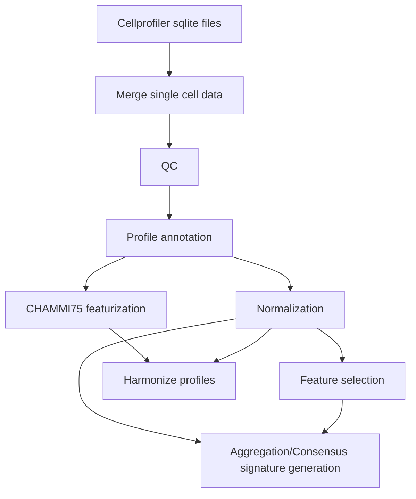

# Image-Based Profiling Module

## Overview
This module performs image-based profiling analysis on pyroptosis live-cell timelapse data from Wave 2 experiments.

```mermaid
graph TD
    A[Cellprofiler sqlite files] --> B[Merge single cell data]
    B --> C[QC]
    C --> D[Profile annotation]
    D --> E[CHAMMI75 featurization]
    D --> F[Normalization]
    F --> G[Feature selection]
    F --> H[Aggregation/Consensus signature generation]
    G --> H
    E --> I[Harmonize profiles]
    F --> I
```

